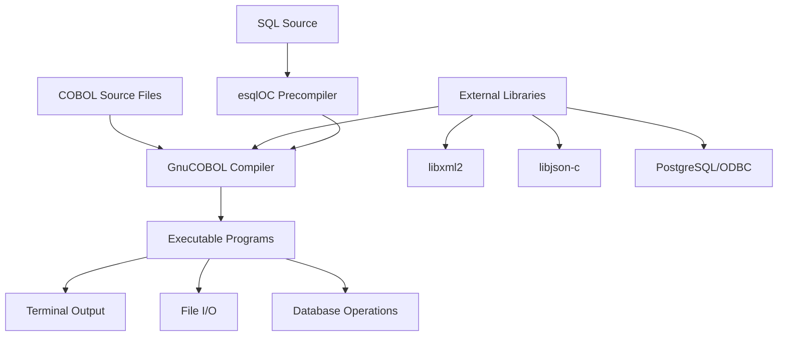

# COBOL Examples

[](LICENSE)

> A comprehensive collection of educational COBOL programs demonstrating core language features,
> database integration, data serialization, and system interaction using the GnuCOBOL compiler on Linux.

## Table of Contents

- [Overview](#overview)
- [Quickstart](#quickstart)
- [Example Categories](#example-categories)
- [Configuration](#configuration)
- [Usage](#usage)
- [Architecture](#architecture)
- [Development](#development)
- [Troubleshooting](#troubleshooting)
- [Contributing](#contributing)
- [License](#license)

## Overview

This repository serves as a comprehensive educational resource for COBOL developers learning to use
the GnuCOBOL compiler in Linux environments. The project targets both newcomers to COBOL and
experienced developers exploring advanced features like database integration, data serialization,
and system interaction.

**Primary Users:**

- COBOL students and educators seeking practical, well-documented examples
- Developers migrating to GnuCOBOL from other COBOL compilers
- System integrators connecting COBOL applications with modern technologies

**Key Capabilities:**

- Demonstrates core COBOL language features with executable examples
- Provides integration patterns for databases (PostgreSQL), data formats (XML/JSON), and system resources
- Includes comprehensive documentation for setup, compilation, and execution
- Shows best practices for COBOL development in modern Linux environments

## Quickstart

### Prerequisites

- OS: Linux (primary target), macOS, Windows with appropriate libraries
- Runtime: [GnuCOBOL](https://gnucobol.sourceforge.io/) compiler
- Tools: Basic development environment with terminal access

### Setup

```bash
$ git clone https://github.com/CognitionEdu/COBOL-Examples.git
$ cd COBOL-Examples
```

### Run Your First Example

```bash
$ cd display_test
$ cobc -x display-test.cbl
$ ./display-test
```

### Verify Installation

```bash
$ cobcrun --info
```

## Example Categories

The repository is organized into feature-based directories, each containing `.cbl` source files and documentation:

### Core Language Features

- **[accept/](accept/)** - User input and system data retrieval patterns
- **[display_test/](display_test/)** - Screen output and positioning
- **[trim/](trim/)** - String manipulation with intrinsic functions
- **[unstring/](unstring/)** - String parsing and tokenization techniques
- **[redefines/](redifines/)** - Memory layout control and data structure overlays
- **[search/](search/)** - Table search operations (binary and sequential)

### Data Processing

- **[json_generate/](json_generate/)** - JSON serialization using libjson-c
- **[xml_generate/](xml_generate/)** - XML document generation using libxml2
- **[merge_sort/](merge_sort/)** - Data sorting and merging operations
- **[numval_test/](numval_test/)** - Numeric value conversion and validation
- **[is_numeric/](is_numeric/)** - Numeric data type checking

### System Integration

- **[sql/](sql/)** - Database integration with PostgreSQL using esqlOC precompiler
- **[sub_program/](sub_program/)** - Inter-program communication and memory management
- **[read_command_args/](read_command_args/)** - Command-line argument processing
- **[screen_size/](screen_size/)** - Terminal dimension detection and screen operations
- **[mouse/](mouse/)** - Mouse input handling and simple graphics

### Advanced Features

- **[report_writer/](report_writer/)** - Report generation and formatting
- **[comp_test/](comp_test/)** - Computational data types and operations
- **[display_timing/](display_timing/)** - Performance testing and screen output timing

## Configuration

### Basic Compilation

Most examples use standard compilation:

```bash
$ cobc -x program-name.cbl
```

### External Library Dependencies

| Feature | Library | Configuration Flag | Required For |
|---------|---------|-------------------|--------------|
| JSON Generation | libjson-c | `--with-json` | json_generate/ |
| XML Generation | libxml2 | `--with-xml2` | xml_generate/ |
| Database Access | PostgreSQL + unixODBC | `--with-db` | sql/ |

**Configure GnuCOBOL with Libraries:**

```bash
$ ./configure --with-json --with-xml2 --with-db
$ make && make install
```

**Verify Library Support:**

```bash
$ cobcrun --info
# Should show:
# JSON library             : json-c, version X.X.X
# XML library              : libxml2, version X.X.X
```

### Database Setup (for SQL examples)

```bash
# Install PostgreSQL and ODBC driver
$ sudo apt-get install postgresql unixodbc odbc-postgresql

# Run the test database setup
$ cd sql/
$ psql -f create_test_db.sql
```

## Usage

### Basic Program Execution

```bash
# Navigate to any example directory
$ cd accept/

# Compile the COBOL program
$ cobc -x accept.cbl

# Run the executable
$ ./accept
```

### Advanced Examples with Preprocessing

```bash
# SQL example with esqlOC precompiler
$ cd sql/
$ esqlOC -static -o generated_sql_ex.cbl sql_example.cbl
$ cobc -x -static -locsql generated_sql_ex.cbl
$ ./generated_sql_ex
```

### Multi-file Programs

```bash
# Sub-program example
$ cd sub_program/
$ cobc -x main_app.cbl sub.cbl -o main_app
$ ./main_app
```

## Architecture



**Key Components:**

- **Source Programs**: Individual `.cbl` files demonstrating specific features
- **GnuCOBOL Compiler**: Translates COBOL to executable machine code
- **External Libraries**: Optional libraries for advanced functionality
- **Precompilers**: Tools like esqlOC for embedded SQL processing
- **Runtime Environment**: Linux terminal with ncurses support for screen operations

## Development

### Local Development Commands

```bash
# Format and validate (manual process)
$ # COBOL formatting is typically done manually following style conventions

# Compile with debug information
$ cobc -x -g program.cbl

# Run with debugging
$ gdb ./program

# Check program information
$ cobcrun --info
$ cobcrun --runtime-conf
```

### Testing Examples

```bash
# Test basic compilation across all examples
$ find . -name "*.cbl" -exec cobc -fsyntax-only {} \;

# Run specific example with expected input
$ cd accept/
$ echo "test input" | ./accept_from "arg1" "arg2"
```

### Code Style Guidelines

- Follow standard COBOL formatting with proper indentation
- Use descriptive program-id names matching directory themes
- Include header comments with author, date, purpose, and compilation instructions
- Document complex operations with inline comments

## Troubleshooting

### Common Issues

#### Compilation Errors

- **Symptom**: `cobc: command not found`
- **Cause**: GnuCOBOL not installed or not in PATH
- **Fix**: Install GnuCOBOL and ensure it's in your system PATH

#### Library Missing

- **Symptom**: `JSON/XML GENERATE not supported`
- **Cause**: GnuCOBOL compiled without library support
- **Fix**: Reconfigure and rebuild GnuCOBOL with `--with-json` or `--with-xml2`

#### Screen Mode Issues

- **Symptom**: Output appears in wrong screen positions
- **Cause**: Program entered "COBOL screen mode" without proper positioning
- **Fix**: Use explicit LINE/COLUMN positioning or SCREEN SECTION

#### Database Connection Errors

- **Symptom**: SQL operations fail with connection errors
- **Cause**: PostgreSQL not running or ODBC not configured
- **Fix**: Start PostgreSQL service and configure ODBC data sources

### Platform-Specific Notes

- **Linux**: Primary development platform, full feature support
- **macOS**: Requires Homebrew installation of dependencies
- **Windows**: Limited support, consider using WSL or Linux VM

## Contributing

This repository is actively maintained with ongoing documentation improvements. Each directory 
contains individual COBOL example programs that can be compiled and executed independently.

### Development Setup

- Follow README Quickstart instructions
- Create branches following pattern: `feature/example-name`
- Test compilation and execution before submitting changes

#### Coding Standards

- Include comprehensive header comments in all `.cbl` files
- Provide README.md documentation for each example directory
- Follow existing naming conventions and code structure
- Test examples on Linux with GnuCOBOL

#### Pull Requests

- Small, focused changes preferred
- Include example output in README files
- Test compilation and execution
- Link related issues or feature requests

## License

SPDX: MIT — see [LICENSE](LICENSE).

Copyright (c) 2021 Erik E

All programs were written using [GnuCOBOL](https://gnucobol.sourceforge.io/) in Linux.  


